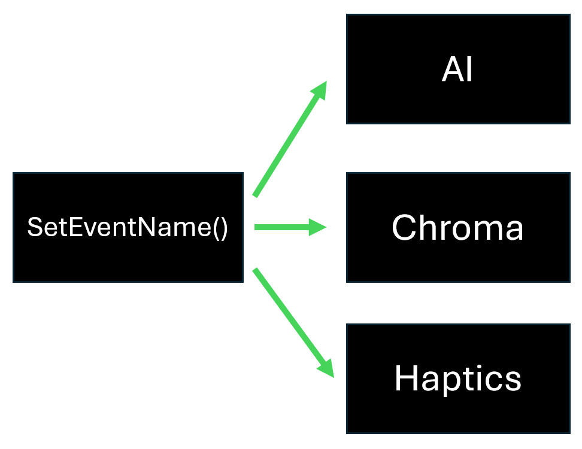

# WYVRN SDK

The `WYVRN SDK` is the all-in-one SDK for all Razer technologies: AI Gaming Tools, Chroma RGB, and Sensa HD Haptics.
The `WYVRN SDK` integration process happens in collaboration with the Razer/WYVRN Team, who designs the Chroma animations, haptic effects, and provides the AI integration. 
Click here to contact us on [Discord](https://discord.gg/HVa96T6BZu). 
*Unlike the Chroma RGB SDK and Interhaptics SDK which can be used independently (without WYVRN team involvement), the WYVRN SDK integration requires working directly with the WYVRN team as everything is hosted on the Razer Synapse side. Game developers don't need to design their own haptic effects or Chroma animations when using the WYVRN SDK - this is handled by the WYVRN team.

**What WYVRN offers:**
- Chroma RGB integration and design
- Sensa HD Haptics integration and design
- AI integration

## Overview

The `WYVRN SDK` allows developers to name events for game state, player state, abiltities, actions, and environments. The external WYVRN configuration controls AI, Chroma, and haptics.

The WYVRN SDK is the combination of AI, Chroma, and Razer Sensa HD Haptics in a single SDK. By integrating AI, RGB lighting and haptics into game environments and events, players can enjoy a truly immersive gaming experience. The `WYVRN SDK` is capable of playing Chroma animations and haptics on the Razer Sensa HD Haptics devices. `SetEventName()` can trigger AI interaction, RGB lighting, or haptics or all of the above.

## Downloads

| Engine | Git Repo | Download Link |
|----------|---------|---------------|
| WYVRN C++ SDK  | [Git](https://github.com/WyvrnOfficial/CSDK_WyvrnSDK_GameSample)   | [Download](https://github.com/WyvrnOfficial/CSDK_WyvrnSDK_GameSample/archive/refs/heads/UNICODE.zip) |
| WYVRN Unreal SDK    | [Git](https://github.com/WyvrnOfficial/Unreal_WyvrnSDK)   | [Download](https://github.com/WyvrnOfficial/Unreal_WyvrnSDK/archive/refs/heads/UNICODE.zip)   |
| WYVRN Unity SDK    | [Git](https://github.com/WyvrnOfficial/Unity_WyvrnSDK)   | [Download](https://github.com/WyvrnOfficial/Unity_WyvrnSDK/archive/refs/heads/UNICODE.zip)   |

## Latest

See [https://wyvrn.com](https://wyvrn.com) and [https://doc.wyvrn.com](https://doc.wyvrn.com) for the latest updates and documentation about the WYVRN SDK.
